# Application Flow Document
## Cohort PCCOE — User Journeys & Navigation Architecture

**Version:** 1.0  
**Date:** 2026-08-17  

---

## 1. Top-Level Navigation Architecture

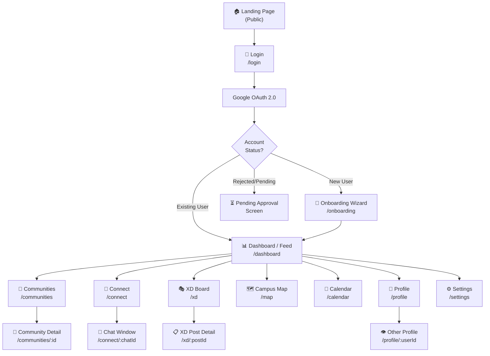

---

## 2. Authentication Flow

```mermaid
flowchart TD
    A([User visits site]) --> B{Session cookie\nvalid?}
    B -- Yes --> C{Profile\ncomplete?}
    C -- Yes --> DASH[/dashboard]
    C -- No --> ONB[/onboarding]
    B -- No --> LAND[Landing Page]
    LAND --> BTN["Click 'Sign in with Google'"]
    BTN --> GAUTH[Google OAuth Popup]
    GAUTH --> GDONE{Auth\nsuccessful?}
    GDONE -- No --> ERR["❌ Show error toast\n'Authentication failed'"]
    ERR --> LAND
    GDONE -- Yes --> DOMAIN{Email domain\n= pccoe.org?}
    DOMAIN -- No --> DENY["❌ Access Denied\n'Platform is for PCCOE only'"]
    DOMAIN -- Yes --> NEWUSER{First\ntime?}
    NEWUSER -- Yes --> CREATEPROFILE["Create user record\nin Supabase"]
    CREATEPROFILE --> ONB[/onboarding]
    NEWUSER -- No --> C
    ONB --> STEP1["Step 1: Basic Info\n(Name, Year, Branch, Division)"]
    STEP1 --> STEP2["Step 2: Profile Picture\n(Upload or use Google photo)"]
    STEP2 --> STEP3["Step 3: Interests & Skills"]
    STEP3 --> STEP4["Step 4: Subscribe to Communities\n(Pick ≥1)"]
    STEP4 --> DONE["✅ Profile Complete\nMark is_onboarded = true"]
    DONE --> DASH
```

---

## 3. Home Feed Flow

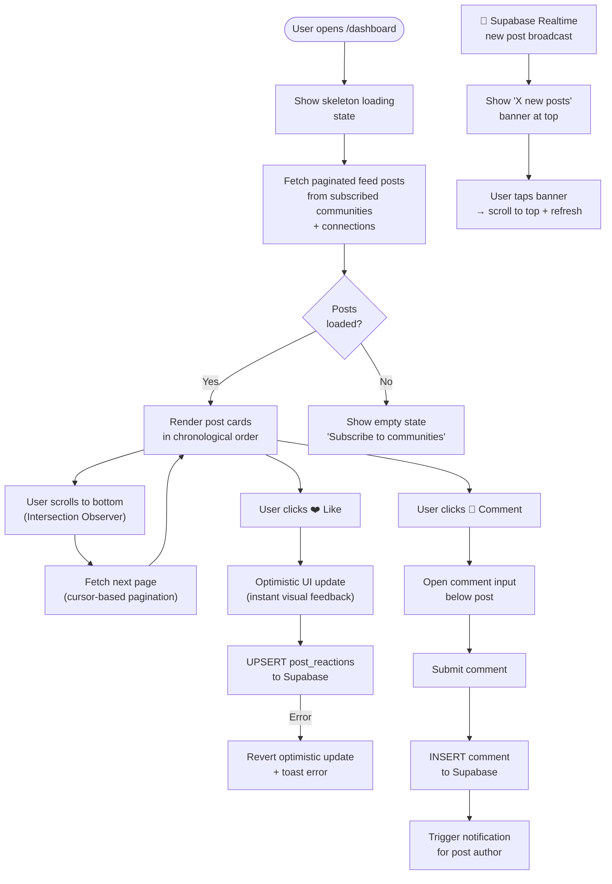

---

## 4. Communities Flow

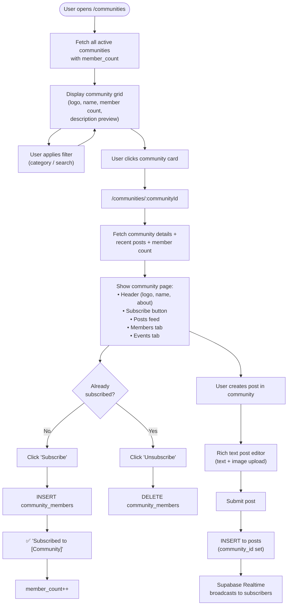

---

## 5. Connect (Messaging) Flow

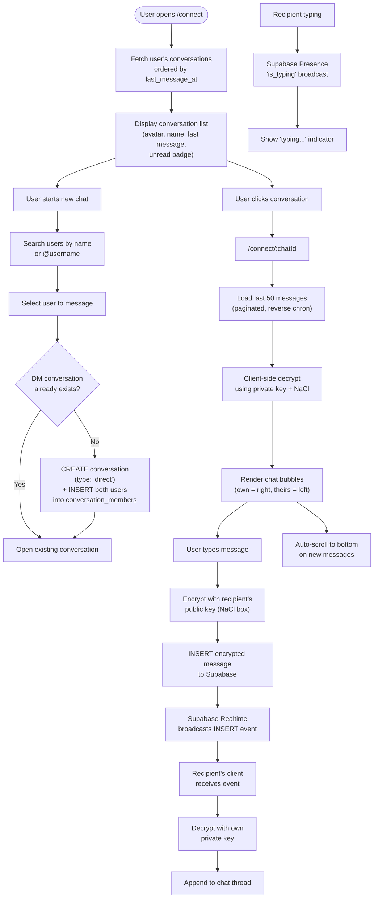

---

## 6. XD (Exchange) Board Flow

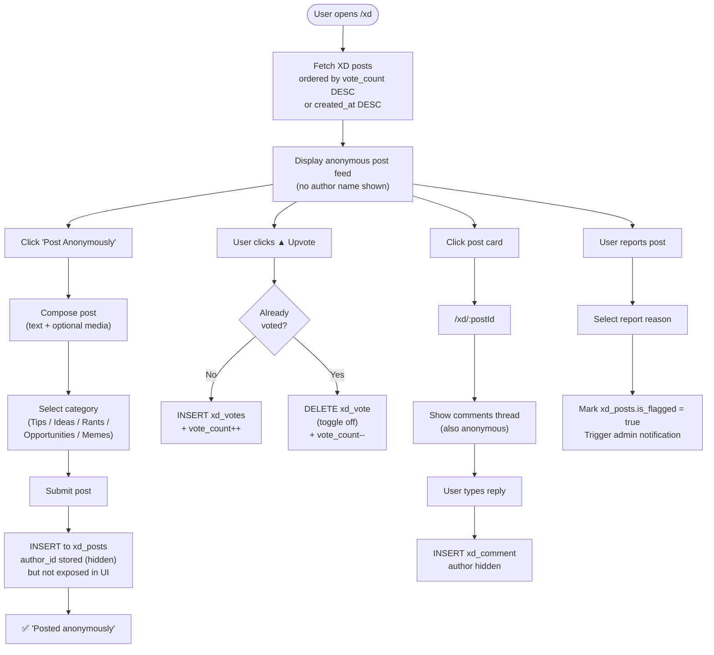

---

## 7. Campus Map Flow

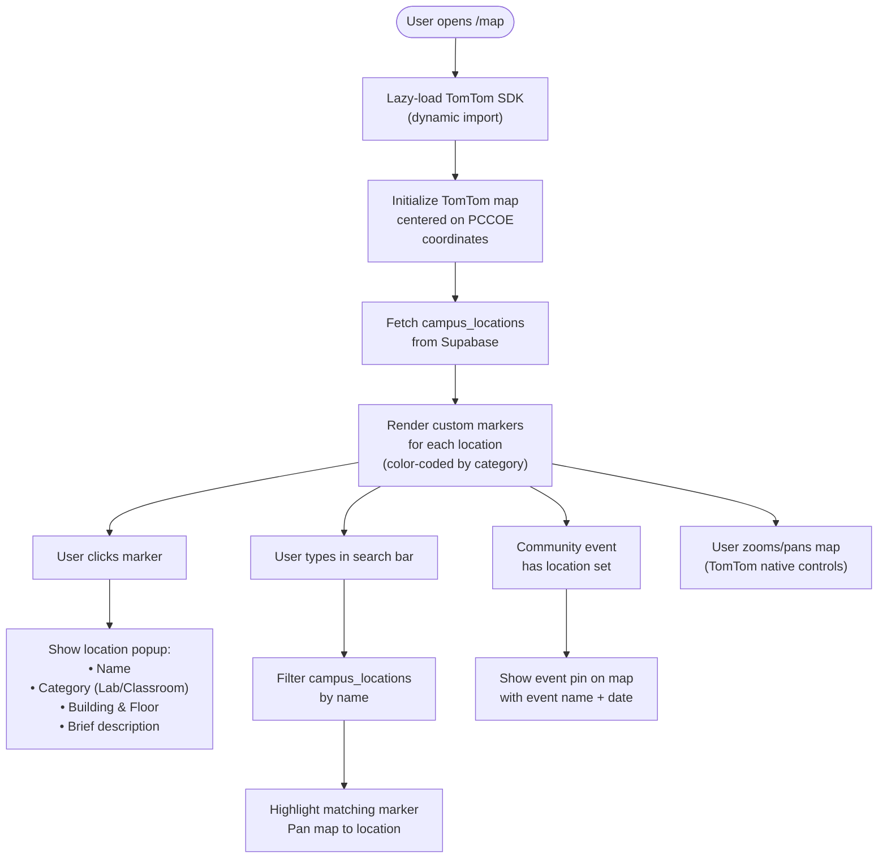

---

## 8. Academic Calendar Flow

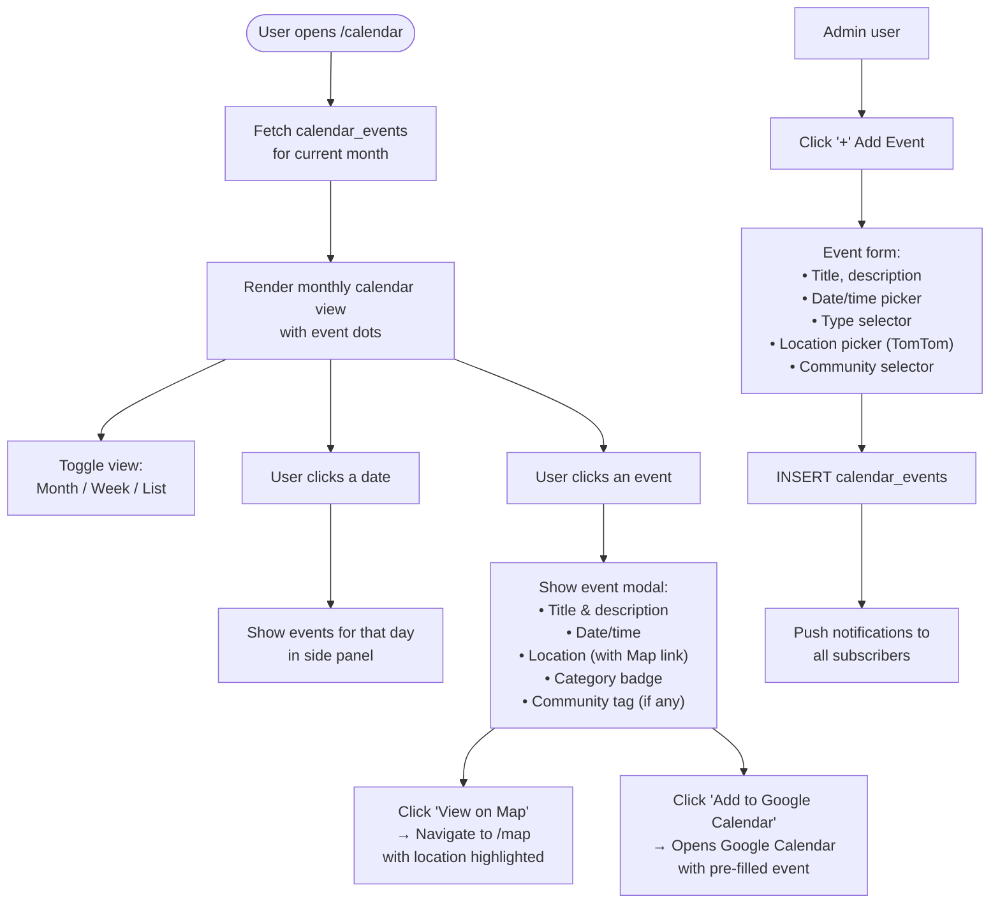

---

## 9. Profile Flow

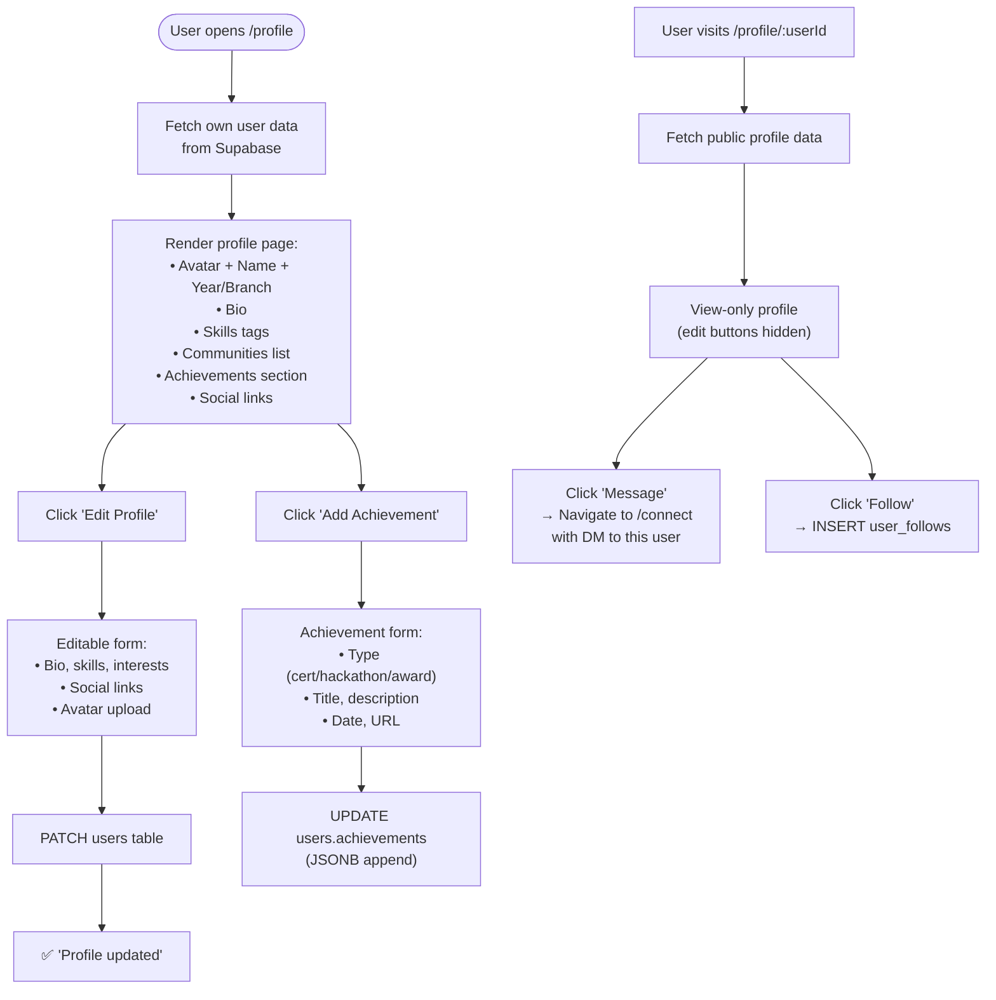

---

## 10. Notification Flow

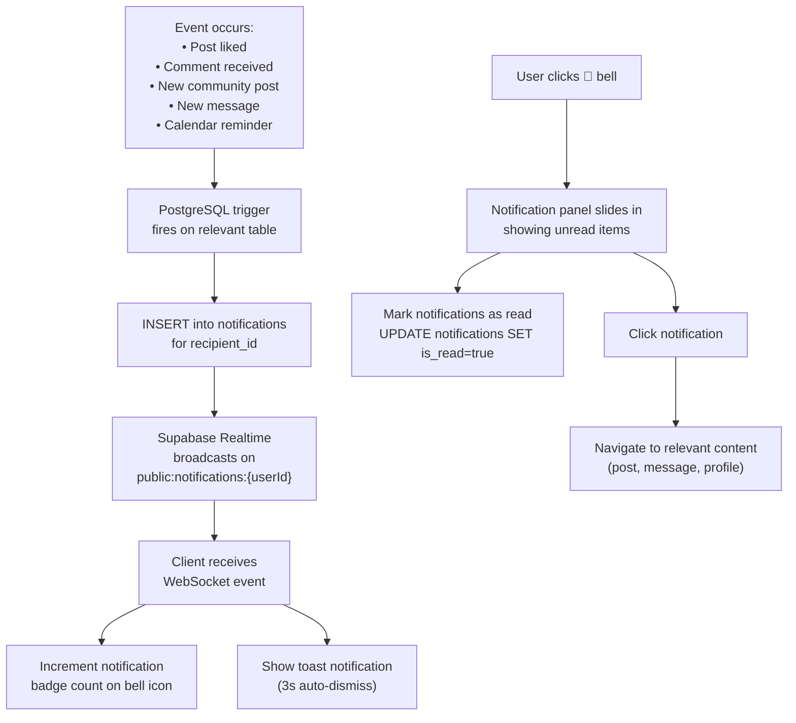

---

## 11. Search Flow

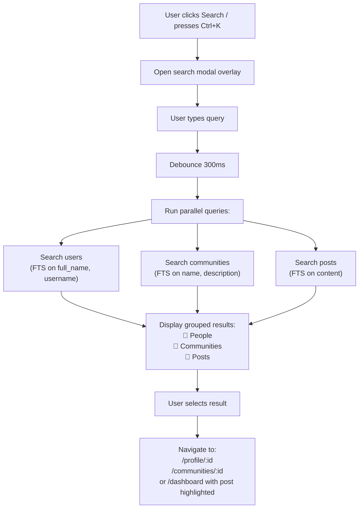

---

## 12. Error States & Fallbacks

| Scenario | Handling |
|---|---|
| Network offline | Show offline banner, queue actions locally |
| Supabase unreachable | Show service unavailable screen, retry button |
| Unauthorized access (RLS violation) | Redirect to /login |
| 404 route | Show friendly 404 page with home link |
| OAuth failure | Toast error + stay on login page |
| Message send failure | Show retry button on failed message bubble |
| Image upload failure | Show error, keep draft content intact |

---

## 13. Session & Auth State Machine

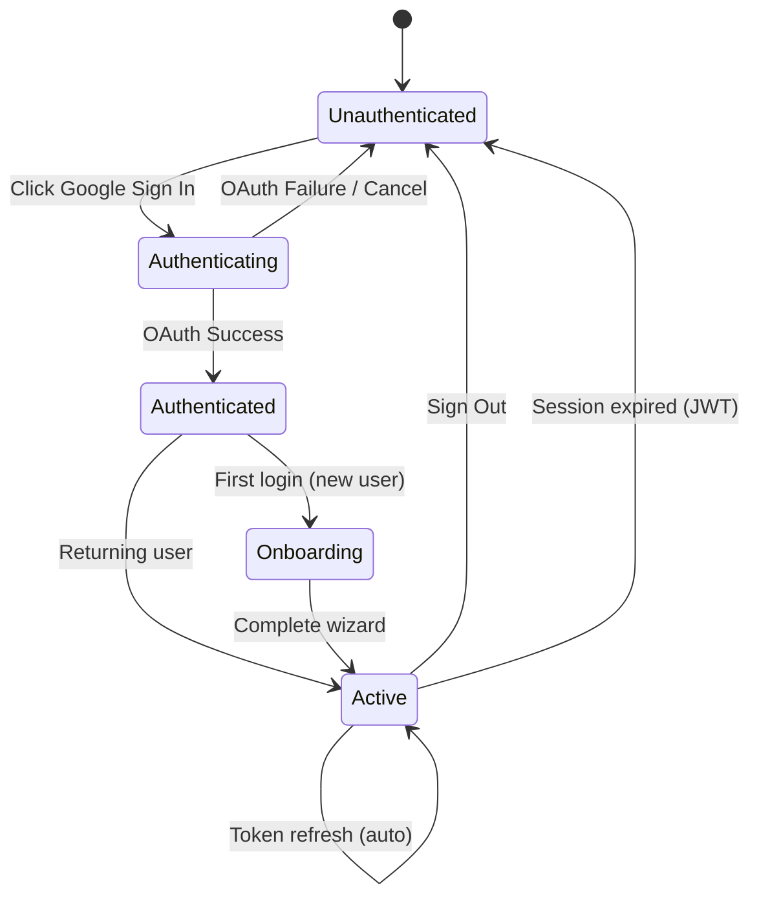
